# WinStreamX 项目架构设计

本文档用于说明 WinStreamX 的整体系统架构。后续每个阶段的实现都以这份架构为主线推进。

WinStreamX 的目标不是实现驱动或商业级远程桌面，而是实现一个可以本地运行、可以测试、可以用于面试讲解的 Windows 用户态图形采集、GPU 处理、H.264 编码传输与接收端渲染系统。

## 1. 项目定位

WinStreamX 重点覆盖两类技术方向：

```text
GPU / 图形方向：
    DXGI Desktop Duplication
    D3D11 Device / Context / Texture
    GPU -> CPU 同步
    D3D11 SwapChain 渲染
    Compute Shader 图像前处理
    渲染性能统计

音视频方向：
    BGRA / NV12 / YUV420P 像素格式
    FFmpeg H.264 编码 / 解码
    FFmpeg libavformat RTP / RTSP 封装
    RTP timestamp / sequence number / RTCP 统计
    端到端延迟、码率、丢包率、jitter 统计
```

一句话定位：

```text
WinStreamX 是一个基于 Windows DXGI/D3D11 与 FFmpeg 的低延迟桌面图形采集、GPU 处理、H.264 传输和接收端渲染 Pipeline。
```

## 2. 架构总览

当前阶段采用 Server-first 路线，先完成 Server 端，再做 Client 端。

当前 Server 程序：

```text
winstreamx_server.exe
    负责桌面采集、GPU 前处理、H.264 编码、网络发送。
```

Server 端分层：

```text
Layer 1: Server App & Runtime
Layer 2: Capture Layer
Layer 3: Frame Pipeline Layer
Layer 4: Encode Layer
Layer 5: Media Transport Layer
Layer 6: Supporting Infrastructure
```

Server 端整体数据流：

```text
Windows Desktop
        ↓
DXGI Desktop Duplication
        ↓
D3D11 Texture / BGRA Frame
        ↓
GPU / CPU Convert
        ↓
H.264 Encoder
        ↓
SendQueue + RingBuffer
        ↓
FFmpeg RTP / RTSP Transport
```

后续 Client 再补：

```text
Receive Layer -> Decode Layer -> Render Layer
```

## 3. 与参考 Pipeline 的对应关系

参考 Pipeline 的核心思想是：

- 帧获取、编码、发送、渲染分阶段处理。
- 帧获取到编码之间使用事件式通知，而不是无限队列。
- 编码到发送之间使用队列解耦。
- 使用 RingBuffer 记录帧历史和丢帧信息。
- 队列满或发送侧拥塞时优先丢帧，避免延迟累积。
- 每个阶段都要有性能统计和异常恢复策略。

WinStreamX 的对应设计如下：

| 参考 Pipeline 概念 | WinStreamX 对应模块 | 说明 |
|--------------------|---------------------|------|
| 系统提供桌面帧 | DXGI Desktop Duplication | 用户态桌面采集 API，用于替代驱动侧帧来源 |
| 帧获取线程 | `CaptureThread` | 负责获取桌面帧、生成 frame_id 和时间戳 |
| 编码启动事件 | `FrameSlot` + `condition_variable` | 采集线程通知编码线程处理最新帧 |
| 双缓冲 / 单帧槽位 | `FrameSlot` / `FrameBufferSlot` | 避免采集帧无限堆积 |
| 编码线程 | `EncodeThread` | 当前先 MockEncode，后续接 FFmpeg H.264 |
| 编码输出包 | `EncodedPacket` | 保存 frame_id、timestamp、key_frame、payload |
| 发送队列 | `SendQueue` | 有界队列，位于编码线程和发送线程之间 |
| RingBuffer | `FrameHistoryRing` | 记录最近 N 帧元信息，用于丢帧和延迟分析 |
| 发送线程 | `MediaTransportThread` | 当前先 MockSend，后续通过 FFmpeg libavformat 输出 RTP / RTSP |
| Client 渲染 | 后续 `winstreamx_client` | Windows Client 窗口，负责解码和渲染 |
| 显示输出 | D3D11 SwapChain | 接收端将解码帧显示到窗口 |

## 4. Server 端设计

Server 端主链路：

```text
CaptureThread
        ↓
FrameSlot / EncodeSignal
        ↓
EncodeThread
        ↓
SendQueue
        ↓
MediaTransportThread
```

### 4.1 CaptureThread

职责：

- 创建 D3D11 device 和 context。
- 初始化 DXGI Desktop Duplication。
- 连续采集桌面帧。
- 为每帧生成 `frame_id`。
- 记录 `capture_timestamp_us`。
- 将最新帧写入 `FrameSlot`。
- 通知 `EncodeThread`。

第一阶段输出：

```cpp
struct CapturedFrameBgra {
    std::vector<uint8_t> pixels;
    uint32_t width;
    uint32_t height;
    uint32_t stride_bytes;
};
```

后续优化输出：

```text
ID3D11Texture2D
```

这样可以减少 GPU 到 CPU 的 readback 成本，并为 Compute Shader 前处理做准备。

### 4.2 FrameSlot / EncodeSignal

采集到编码之间不使用普通队列作为主设计，而使用事件式同步。

设计原因：

- 实时显示系统更需要最新帧，不需要把每一帧都排队处理。
- 如果编码线程慢，采集线程可以覆盖旧的未编码帧。
- 这样可以避免延迟随着队列积压越来越大。

建议数据结构：

```cpp
struct FrameSlot {
    CapturedFrameBgra frame;
    uint64_t frame_id;
    int64_t capture_timestamp_us;
    bool has_frame;
};
```

同步方式：

```text
std::mutex
std::condition_variable
std::atomic_bool stop_requested
```

### 4.3 EncodeThread

职责：

- 等待 `FrameSlot` 中出现新帧。
- 取走最新帧。
- 执行颜色转换。
- 调用 H.264 编码器。
- 生成 `EncodedPacket`。
- 推入 `SendQueue`。

分阶段实现：

```text
Phase A:
    MockEncode，只生成模拟 packet 和耗时统计。

Phase B:
    CPU BGRA -> YUV420P，FFmpeg H.264 编码。

Phase C:
    BGRA -> NV12，低延迟编码参数调优。

Phase D:
    Compute Shader 实现 GPU 颜色转换。
```

编码输出：

```cpp
struct EncodedPacket {
    uint64_t frame_id;
    int64_t capture_timestamp_us;
    int64_t encode_done_timestamp_us;
    bool key_frame;
    std::vector<uint8_t> payload;
};
```

### 4.4 SendQueue

`SendQueue` 位于：

```text
EncodeThread -> MediaTransportThread
```

它是 Server 端的核心队列，用来解耦编码速度和媒体传输速度。

队列策略：

```text
队列未满：
    直接 push packet

队列已满：
    丢弃最旧 packet
    push 最新 packet
    dropped_packets++
```

这个策略的目标是低延迟：

```text
宁可丢掉中间帧，也不要把旧画面排队很久之后再显示。
```

### 4.5 FrameHistoryRing

RingBuffer 不保存大图像数据，只保存最近 N 帧的元信息。

建议结构：

```cpp
struct FrameHistory {
    uint64_t frame_id;
    int64_t capture_timestamp_us;
    int64_t encode_start_timestamp_us;
    int64_t encode_done_timestamp_us;
    int64_t send_done_timestamp_us;
    bool dropped_before_encode;
    bool dropped_before_send;
};
```

用途：

- 追踪最近 N 帧。
- 计算采集耗时、编码耗时、发送等待时间。
- 检测丢帧。
- 后续用于生成性能 CSV。

## 5. 后续 Client 端设计

接收端主链路：

```text
ReceiveThread
        ↓
DecodeQueue
        ↓
DecodeThread
        ↓
RenderFrameSlot
        ↓
RenderThread
```

### 5.1 ReceiveThread

职责：

- 通过 FFmpeg libavformat 打开 RTP / RTSP 输入。
- 从 demuxer 读取 H.264 packet。
- 读取 RTP timestamp、sequence number 等媒体时间信息。
- 将完整 H.264 packet 推入 `DecodeQueue`。
- 调试模式下支持 TCP framed H.264 输入，用于本机端到端正确性验证。

### 5.2 DecodeThread

职责：

- 从 `DecodeQueue` 取出 H.264 packet。
- 使用 FFmpeg 解码。
- 输出 BGRA / NV12 frame。
- 检测 `frame_id` 是否连续。
- 统计 decode FPS、decode cost、packet loss。

### 5.3 RenderThread

职责：

- 创建 Win32 窗口。
- 创建 D3D11 device。
- 创建 D3D11 SwapChain。
- 上传解码后的视频帧到 D3D11 Texture。
- 绘制视频帧。
- 绘制性能 HUD。
- 调用 `Present()` 显示。

接收端窗口是只读预览窗口：

```text
它显示 Server 端桌面画面，但不接管鼠标键盘，也不是一个可操作的新桌面。
```

## 6. 渲染前端 / 后端分层

为了贴近图形渲染岗位，接收端渲染不只写成一个大函数，而是拆成轻量渲染框架。

### 6.1 RenderFrontend

负责描述“要画什么”：

```text
VideoFrameLayer
StatsOverlayLayer
DirtyRectDebugLayer
CursorOverlayLayer
```

第一版只需要：

```text
VideoFrameLayer
StatsOverlayLayer
```

### 6.2 RenderBackend

负责“怎么用 GPU 画”：

```text
D3D11TextureRenderer
D3D11OverlayRenderer
SwapChainPresenter
```

第一版只需要：

```text
D3D11TextureRenderer
SwapChainPresenter
```

这样项目可以自然讲清楚：

```text
前端组织渲染内容，后端封装 D3D11 调用。
```

## 7. 媒体传输设计

WinStreamX 的正式传输层采用工业常见的 RTP / RTSP 方案，优先复用 FFmpeg libavformat，避免重复实现 H.264 RTP 分包、解复用和会话管理。

### 7.1 正式传输模式：RTP / RTSP

Server 端：

```text
EncodeThread
        ↓
FFmpeg libavcodec H.264 encoder
        ↓
AVPacket / EncodedPacket(H.264)
        ↓
SendQueue
        ↓
FFmpeg libavformat muxer
        ↓
RTP / RTSP
        ↓
Network
```

接收端：

```text
Network
        ↓
FFmpeg libavformat demuxer
        ↓
H.264 packet
        ↓
DecodeQueue
```

职责：

- `EncodeThread` 使用 FFmpeg `libavcodec` 负责 H.264 编码。
- `MediaTransportThread` 从 `SendQueue` 取出 H.264 `AVPacket` / `EncodedPacket`。
- `MediaTransportThread` 调用 FFmpeg `libavformat` muxer 做 RTP / RTSP 封装和输出。
- 使用 RTP / RTSP 承载实时视频流。
- 使用 RTP sequence number 和 timestamp 做顺序、丢包和时间统计。
- 使用 RTCP 思路统计丢包率、jitter、RTT 等指标。

### 7.2 调试传输模式：TCP framed H.264

TCP framed H.264 只作为调试模式，用于最早期验证编码输出和接收端解码是否正确。

建议调试包头：

```cpp
struct DebugPacketHeader {
    uint32_t magic;
    uint16_t version;
    uint16_t flags;
    uint64_t frame_id;
    uint64_t timestamp_us;
    uint32_t payload_size;
};
```

字段说明：

| 字段 | 作用 |
|------|------|
| `magic` | 协议标识 |
| `version` | 协议版本 |
| `flags` | key frame、fragment、end 等标志 |
| `frame_id` | 帧序号 |
| `timestamp_us` | 采集时间戳 |
| `payload_size` | payload 字节数 |

调试模式不作为最终工业传输主线。最终简历和面试表达以 RTP / RTSP 为主。

### 7.3 后续扩展

后续可以扩展：

```text
WebRTC / SRTP：
    用于实时通信、NAT 穿透和弱网控制。

QUIC：
    用于现代可靠低延迟传输实验。
```

这些不是第一阶段目标，避免工程复杂度过早膨胀。

## 8. 同步与线程模型

主要同步方式：

| 位置 | 同步方式 | 目的 |
|------|----------|------|
| CaptureThread -> EncodeThread | `condition_variable` | 通知编码线程有新帧 |
| EncodeThread -> MediaTransportThread | `BlockingQueue` | 解耦编码和媒体传输 |
| ReceiveThread -> DecodeThread | `BlockingQueue` | 解耦接收和解码 |
| DecodeThread -> RenderThread | FrameSlot | 渲染只需要最新解码帧 |
| 全局停止 | `atomic_bool` | 线程安全退出 |
| 指标计数 | `atomic<uint64_t>` | 无锁统计基础计数 |

线程设计原则：

- 不在主线程做长时间阻塞工作。
- 队列必须有容量上限。
- 实时链路优先保留最新帧。
- 队列空时阻塞等待，避免 busy wait。
- 所有线程必须可停止、可 join。

## 9. 丢帧与恢复策略

### 9.1 当前策略

```text
FrameSlot 被覆盖：
    说明编码线程跟不上采集线程，记录 dropped_before_encode。

SendQueue 满：
    drop oldest packet，记录 dropped_before_send。
```

### 9.2 H.264 阶段策略

H.264 有帧间依赖，所以丢帧后要考虑恢复。

策略：

- 记录丢失的 `frame_id`。
- 如果丢掉非关键帧，接收端继续尝试解码。
- 如果解码失败，等待下一帧关键帧。
- Server 端在队列频繁满或 Client 请求恢复时，强制下一帧为 IDR。

第一版可以先不做反馈通道，只做：

```text
固定 GOP，定期产生关键帧。
```

## 10. 性能指标

Server 端指标：

| 指标 | 含义 |
|------|------|
| `capture_fps` | 实际采集帧率 |
| `capture_ms` | 单帧采集耗时 |
| `gpu_copy_ms` | GPU 到 CPU 拷贝耗时 |
| `convert_ms` | 像素格式转换耗时 |
| `encode_ms` | 编码耗时 |
| `send_queue_depth` | 发送队列积压 |
| `dropped_before_encode` | 编码前被覆盖的帧数 |
| `dropped_before_send` | 发送前被丢弃的 packet 数 |
| `bitrate_mbps` | 发送码率 |

接收端指标：

| 指标 | 含义 |
|------|------|
| `receive_mbps` | 接收码率 |
| `decode_ms` | 解码耗时 |
| `render_ms` | 渲染耗时 |
| `present_fps` | SwapChain Present 帧率 |
| `packet_loss` | packet 丢失数量 |
| `end_to_end_latency_ms` | 采集到显示的端到端延迟 |

## 11. 阶段实现路线

### Phase 0：最小 Server 工程

目标：

- CMake + Visual Studio 工程。
- `winstreamx_server.exe --version` 可运行。
- `winstreamx_server.exe --pipeline` 能打印 6 层架构。

### Phase 1：Server Capture Layer

目标：

- DXGI Desktop Duplication 抓取一帧桌面。
- 保存为 BMP。

验收：

```powershell
.\build\Debug\winstreamx_server.exe --mode capture --output frame.bmp
```

### Phase 2：Server Frame Pipeline Layer

目标：

```text
CaptureThread -> FrameSlot -> MockEncodeThread -> SendQueue -> MockSendThread
```

验收：

- 采集线程能连续采集帧。
- 编码线程由 FrameSlot 信号唤醒。
- SendQueue 满时会丢旧 packet。
- 输出 capture FPS、mock encode FPS、send queue depth、dropped packet。

### Phase 3：Server Encode Layer

目标：

```text
CaptureThread -> EncodeThread -> SaveThread
```

验收：

- 输出 `.h264` 或 `.mp4`。
- 文件可以被播放器或 FFmpeg 解码。
- 输出 encode_ms 和 bitrate。

### Phase 4：Server Media Transport Layer

目标：

```text
CaptureThread -> EncodeThread -> SendQueue -> FFmpeg libavformat RTP/RTSP
```

验收：

- 使用 ffplay / VLC / ffmpeg 可以拉流。
- 能输出 bitrate、send queue depth、RTP timestamp/sequence 相关统计。

### Phase 5：Client Receive / Decode / Render

目标：

```text
RTP/RTSP receive -> decode -> D3D11 render
```

验收：

- 本机 `127.0.0.1` 可运行 Server 和 Client。
- Client 窗口显示 Server 桌面视频流。
- 输出端到端延迟。

### Phase 6：GPU Compute Shader 前处理

目标：

- 使用 Compute Shader 做 `BGRA -> NV12`。
- 和 CPU 转换耗时对比。

验收：

- 输出 CPU/GPU 转换耗时对比。
- README 中记录测试结果。

### Phase 7：WebRTC / QUIC 扩展评估

目标：

- 评估是否接入 WebRTC / SRTP 或 QUIC。
- 对比 RTP / RTSP 与扩展协议在低延迟、弱网和部署复杂度上的差异。

验收：

- 文档中给出扩展方案取舍。
- 不影响现有 RTP / RTSP 主链路。

### Phase 8：文档与面试材料

目标：

- README 完整化。
- 架构图。
- 性能数据表。
- 简历 bullet。
- 面试追问清单。

## 12. 最终架构图

```mermaid
flowchart LR
    Desktop["Windows Desktop"] --> Capture["CaptureThread<br/>DXGI Desktop Duplication"]
    Capture --> Slot["FrameSlot<br/>Encode Signal"]
    Slot --> Convert["GPU/CPU Convert<br/>BGRA -> NV12/YUV420P"]
    Convert --> Encode["EncodeThread<br/>H.264 Encoder"]
    Encode --> SendQ["SendQueue<br/>Bounded Queue"]
    SendQ --> NetSend["MediaTransportThread<br/>FFmpeg RTP / RTSP"]
    Encode --> History["FrameHistoryRing<br/>frame_id / timestamp"]
    SendQ --> History

    NetSend --> Network["Network"]
    Network --> Receive["ReceiveThread"]
    Receive --> DecodeQ["DecodeQueue"]
    DecodeQ --> Decode["DecodeThread<br/>H.264 Decoder"]
    Decode --> RenderSlot["RenderFrameSlot<br/>Latest Frame"]
    RenderSlot --> Frontend["RenderFrontend<br/>Video + HUD"]
    Frontend --> Backend["RenderBackend<br/>D3D11"]
    Backend --> SwapChain["SwapChain Present"]
    SwapChain --> Window["Receiver Window"]
```



## 13. 简历表达方向

图形/GPU 方向：

```text
基于 DXGI/D3D11 实现 Windows 桌面图形采集与渲染 Pipeline，完成 D3D11 Texture 管理、接收端 SwapChain 渲染、GPU Compute Shader 前处理和 FPS/延迟/丢帧等全链路性能统计。
```

音视频方向：

```text
基于 FFmpeg 实现低延迟桌面视频编码传输系统，完成 DXGI 采集、H.264 编码、RTP/RTSP 实时媒体传输、接收端解码播放和端到端延迟统计，支持有界队列与实时丢帧策略。
```

综合方向：

```text
实现 WinStreamX：基于 Windows DXGI/D3D11 与 FFmpeg 的桌面图形采集、GPU 前处理、H.264 编码传输和接收端渲染系统，设计多线程实时 Pipeline，并围绕 FPS、队列积压、码率、丢帧率和端到端延迟进行性能分析。
```
