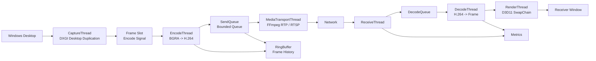

# WinStreamX Pipeline 设计

本文档定义 WinStreamX 后续开发遵循的主 Pipeline。当前采用 Server-first 路线，先实现 Windows 用户态桌面采集、H.264 编码和 RTP/RTSP 输出，再实现接收端解码渲染。

WinStreamX 不实现显示驱动，不把接收端做成可交互的新桌面。当前 Server 端定位是：

```text
Server 采集真实桌面
        ↓
编码成视频流
        ↓
通过 RTP / RTSP 传输
        ↓
ffplay / VLC / 后续 Client 解码播放
```

## 1. 总体 Pipeline

```text
CaptureThread
    DXGI Desktop Duplication 获取桌面帧
    输出 BGRA / D3D11 Texture
        ↓
Frame Slot / Encode Signal
    双缓冲或单帧槽位
    condition_variable 通知编码线程
        ↓
EncodeThread
    BGRA -> NV12 / YUV420P
    FFmpeg H.264 编码
    输出 EncodedPacket
        ↓
SendQueue
    有界队列
    队列满时丢旧 packet
    RingBuffer 记录最近 frame_id / timestamp
        ↓
MediaTransportThread
    FFmpeg libavformat
    RTP / RTSP 输出
        ↓
Future ReceiveThread
    FFmpeg demuxer 接收 H.264 packet
    读取 RTP timestamp / sequence number
        ↓
Future DecodeThread
    FFmpeg H.264 解码
    输出 BGRA / NV12 frame
        ↓
Future RenderThread
    D3D11 SwapChain 渲染到接收端窗口
```

## 2. Server Pipeline

### 2.1 CaptureThread

职责：

- 创建 D3D11 device / context。
- 使用 DXGI Desktop Duplication 获取桌面帧。
- 得到 `ID3D11Texture2D` 或 CPU 可访问的 BGRA 帧。
- 给每一帧分配 `frame_id` 和 `capture_timestamp`。
- 通过事件式通知唤醒编码线程。

第一版实现：

```text
DXGI Desktop Duplication
        ↓
CapturedFrameBgra
        ↓
EncodeSignal
```

后续优化：

- 保留 GPU Texture，减少 GPU -> CPU copy。
- 支持 dirty rect / move rect。
- 统计 capture FPS 和 GPU copy 耗时。

### 2.2 Frame Slot / Encode Signal

这一段不使用普通队列作为主设计，而使用更接近实时显示链路的事件式握手。

设计目标：

- 采集线程只保留最新待编码帧。
- 编码线程空闲时被唤醒。
- 如果编码线程还没处理完上一帧，采集线程可以覆盖旧帧或标记丢帧。
- 避免“采集帧无限排队”导致延迟越来越高。

建议结构：

```cpp
struct FrameSlot {
    CapturedFrameBgra frame;
    uint64_t frame_id;
    int64_t capture_timestamp_us;
    bool has_frame;
};
```

同步方式：

```text
std::mutex
std::condition_variable
std::atomic_bool stop_requested
```

### 2.3 EncodeThread

职责：

- 等待 `Frame Slot` 中出现新帧。
- 读取 BGRA 帧。
- 执行颜色转换：`BGRA -> NV12 / YUV420P`。
- 调用 FFmpeg H.264 编码器。
- 输出 `EncodedPacket`。
- 将编码后的 packet 推入 `SendQueue`。

第一版实现：

```text
MockEncode
```

也就是先不接 FFmpeg，只模拟编码耗时和生成 packet 元数据，用来验证线程模型。

第二版实现：

```text
BGRA -> YUV420P
FFmpeg libx264 / H.264
保存 .h264
```

第三版优化：

```text
BGRA -> NV12
zerolatency
GOP / bitrate / preset 参数调优
```

### 2.4 EncodedPacket

编码线程输出的数据结构：

```cpp
struct EncodedPacket {
    uint64_t frame_id;
    int64_t capture_timestamp_us;
    int64_t encode_done_timestamp_us;
    bool key_frame;
    std::vector<uint8_t> payload;
};
```

字段含义：

- `frame_id`：帧序号，用于检测丢帧和乱序。
- `capture_timestamp_us`：采集时间戳，用于计算端到端延迟。
- `encode_done_timestamp_us`：编码完成时间戳，用于统计编码耗时。
- `key_frame`：是否关键帧。
- `payload`：H.264 NAL 数据。

## 3. SendQueue 与 RingBuffer

### 3.1 SendQueue

`SendQueue` 是 Server 端最重要的队列，放在：

```text
EncodeThread -> MediaTransportThread
```

职责：

- 解耦编码速度和网络发送速度。
- 网络慢时允许短暂缓冲。
- 队列满时执行丢帧策略，保证低延迟。

策略：

```text
队列未满：
    push encoded packet

队列已满：
    drop oldest packet
    push newest packet
    dropped_packets++
```

为什么丢旧 packet：

实时桌面传输更关心“最新画面”，不是把历史帧全部排队播完。排队过多会导致画面延迟越来越大。

### 3.2 RingBuffer

`RingBuffer` 不负责传输大块图像数据，主要记录最近 N 帧的元信息。

建议保存：

```cpp
struct FrameHistory {
    uint64_t frame_id;
    int64_t capture_timestamp_us;
    int64_t encode_done_timestamp_us;
    int64_t send_done_timestamp_us;
    bool dropped;
};
```

用途：

- 记录最近 N 帧。
- 统计丢帧率。
- 计算采集到编码、编码到发送、端到端延迟。
- 后续做网络乱序和丢包分析。

## 4. MediaTransportThread

职责：

- 从 `SendQueue` 中取出 `EncodedPacket`。
- `EncodeThread` 通过 FFmpeg `libavcodec` 生成 H.264 `AVPacket` / `EncodedPacket`。
- `MediaTransportThread` 将 H.264 packet 交给 FFmpeg `libavformat`。
- 通过 RTP / RTSP 输出实时视频流。
- 统计发送耗时、码率、RTP sequence、timestamp 和发送失败次数。

正式模式：

```text
RTP / RTSP
```

原因：

- RTP / RTSP 是工业常见实时媒体传输方案。
- FFmpeg 已经提供 muxer / demuxer，可以避免重复造 H.264 分包轮子。
- 方便和播放器、调试工具、流媒体工具链对接。

调试模式：

```text
TCP framed H.264
```

用于本机端到端正确性验证，不作为最终工业传输主线。

后续扩展：

```text
WebRTC / SRTP
QUIC
```

用于更复杂的实时通信和弱网传输场景。

### 4.1 Debug Packet Header

调试模式建议包头：

```cpp
struct DebugPacketHeader {
    uint32_t magic;
    uint16_t version;
    uint16_t flags;
    uint64_t frame_id;
    uint64_t timestamp_us;
    uint32_t payload_size;
};
```

字段含义：

- `magic`：协议标识，用于判断是否是 WinStreamX 数据包。
- `version`：协议版本。
- `flags`：关键帧、分片、结束标志等。
- `frame_id`：帧序号。
- `timestamp_us`：采集时间戳。
- `payload_size`：后续 payload 字节数。

正式 RTP / RTSP 模式优先使用 FFmpeg 和 RTP 标准字段，不把这个调试包头作为主协议。

## 5. 接收端 Pipeline

### 5.1 ReceiveThread

职责：

- 通过 FFmpeg libavformat 打开 RTP / RTSP 输入。
- 从 demuxer 读取 H.264 packet。
- 读取 RTP timestamp / sequence number。
- 将完整 H.264 packet 推入 `DecodeQueue`。
- 调试模式下可以读取 TCP framed H.264。

### 5.2 DecodeThread

职责：

- 从 `DecodeQueue` 取出 H.264 packet。
- 使用 FFmpeg 解码。
- 输出可渲染的视频帧。
- 统计 decode FPS 和 decode latency。

### 5.3 RenderThread

职责：

- 创建接收端窗口。
- 创建 D3D11 SwapChain。
- 将解码帧上传到 GPU Texture。
- 调用 `Present()` 显示画面。

接收端窗口只是视频播放窗口，不负责控制发送端桌面。

## 6. 同步机制

WinStreamX 使用用户态 C++ 同步原语：

| 场景 | 同步方式 |
|------|----------|
| 采集线程通知编码线程 | `std::condition_variable` |
| SendQueue 生产/消费 | `std::mutex` + `std::condition_variable` |
| 停止线程 | `std::atomic_bool` |
| 统计计数 | `std::atomic<uint64_t>` |
| 后续飞行包控制 | `std::counting_semaphore` 或自定义窗口控制 |

## 7. 丢帧策略

WinStreamX 的原则：

```text
实时性优先于完整性。
宁可丢中间帧，也不让延迟持续累积。
```

当前阶段：

```text
SendQueue 满 -> drop oldest packet
```

后续 H.264 阶段需要注意：

- 如果丢掉 P 帧，后续 P 帧可能依赖丢失帧。
- 队列满或网络丢包后，可以请求下一帧变成 IDR / Key Frame。
- 接收端检测到 frame_id 不连续时，记录丢帧并等待下一个关键帧恢复。

## 8. 性能指标

Server 端统计：

- capture FPS
- capture cost ms
- encode FPS
- encode cost ms
- send queue depth
- dropped packet count
- bitrate

接收端统计：

- receive bitrate
- decode FPS
- render FPS
- packet loss count
- frame reorder count
- end-to-end latency

## 9. 阶段实现路线

### Phase A：Pipeline 骨架

```text
CaptureThread -> EncodeSignal -> MockEncodeThread -> SendQueue -> MockSendThread
```

验收：

- 能连续采集桌面帧。
- 编码线程能被采集线程唤醒。
- SendQueue 满时能丢旧 packet。
- 输出 FPS、队列深度、丢帧数、模拟编码耗时。

### Phase B：本地 H.264 编码

```text
CaptureThread -> EncodeThread -> SaveThread
```

验收：

- 能生成 `.h264` 文件。
- 文件能用播放器或 FFmpeg 解码。
- 输出编码耗时和码率。

### Phase C：Server RTP / RTSP 输出

```text
CaptureThread -> EncodeThread -> SendQueue -> RTP/RTSP Send
```

验收：

- ffplay / VLC / ffmpeg 能拉取 Server 输出的 RTP / RTSP 流。
- 能统计 RTP timestamp、sequence 和输出码率。

### Phase D：Future Client 接收端渲染

```text
ReceiveThread -> DecodeThread -> RenderThread
```

验收：

- Client 窗口能显示 Server 桌面画面。
- 能输出端到端延迟。

### Phase E：WebRTC / QUIC 扩展评估

验收：

- 对比 RTP / RTSP、WebRTC、QUIC 的适用场景。
- 确认是否需要接入 WebRTC / SRTP 或 QUIC。
- 不影响当前 RTP / RTSP 主链路。

### Phase F：GPU 前处理优化

验收：

- 使用 D3D11 Texture / Compute Shader 做 `BGRA -> NV12`。
- 对比 CPU 转换耗时。
- 输出性能对比表。

## 10. 最终目标图


